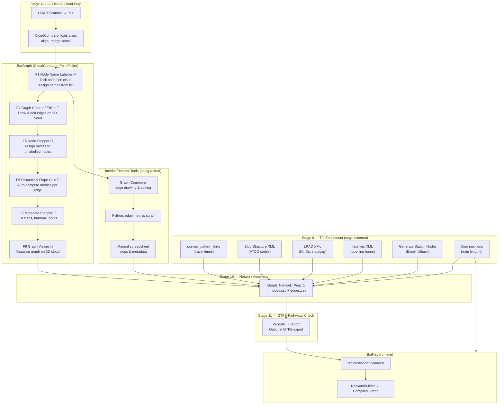

# BatGraph Architecture

## 1. Purpose & Scope

BatGraph is a **specialist LiDAR-to-navigation-graph tool** built as a fork of CloudCompare. Its job is to let an operator scan a station, pick navigation nodes directly on the point cloud, build and edit the graph, compute edge metrics, fill in metadata, and export a clean routing-ready graph — all within one application.

TfL's public data has no detailed internal station topology — it knows platforms exist but not where the exits are relative to the train, how far apart staircases are, or how many steps separate each level. BatGraph fills that gap by capturing real 3D geometry from LiDAR scans, producing a navigation graph with measured distances, gradients, and bearings that no other source provides.

### What makes this graph more detailed than TfL

| Attribute | TfL public data | BatGraph |
|-----------|----------------|----------|
| Platform-to-exit distances | ❌ | ✅ Real 3D measured from scan |
| Exit-to-exit distances along platform | ❌ | ✅ Real measured |
| Step counts per staircase | ❌ | ✅ Captured via Metadata Stepper |
| Gradient / slope | ❌ | ✅ Computed automatically from node coords |
| Bearing / direction | ❌ | ✅ Computed automatically from node coords |
| Train door to nearest exit | ❌ | ✅ Measured from scan |
| Journey times between stations | ✅ Timetables | ✅ Adopted from TfL |
| Accessibility flags (step-free, lifts) | ✅ LRAD XML | ✅ Enriched from TfL |
| Step counts, gap heights | ✅ Facilities XML | ✅ Enriched from TfL |

### Non-goals

- Routing (handled entirely by BatNav at runtime)
- Real-time data ingestion
- Public-facing UI

---

## 2. Architectural Principles

### One tool, one workflow

The target state is that an operator opens BatGraph, loads the scan, and completes the full station graph without switching to Graph Commons, Excel, or Python scripts. External tools are the *current* interim approach; they are being retired stage by stage as BatGraph features are built.

### Point cloud as ground truth

Station topology is derived from LiDAR scans. Every node has real x/y/z coordinates; every walking or vertical edge has a 3D-measured distance computed automatically from those coordinates.

### Named nodes, not anonymous coordinates

Nodes are assigned structured IDs (e.g. `LU.CHL.Cen.W.5A`) the moment they are placed. The name encodes station, line, direction, exit letter, level, and type — the graph is self-describing without a separate lookup table.

### Human-in-the-loop graph editing

Edges are drawn by an operator who understands the station layout. Automatic edge inference from raw point clouds produces too much noise for a routable graph and is not part of this pipeline.

### TfL as reference, not source

TfL data (ATCO codes, journey times, accessibility flags, step counts) enriches and cross-references the graph. It is never the source of topology.

### Excel workbook as operational data store

Data not available from any API — platform levels, exit counts, unity levels, train lengths — is maintained in `LU_Interchanges.xlsx`. For stations not yet scanned, this workbook is also the basis for a computed fallback graph.

---

## 3. High-Level Pipeline

```
Stage 1 │ LiDAR Scanning           → PLY point cloud per station
        │
Stage 2 │ Cloud Preparation        → Load, crop, align, merge scans
        │ (CloudCompare core)         Single merged cloud per station
        │
Stage 3 │ Node Picking             → Place named nodes on cloud
        │ [BatGraph: Node Name        ✅ Built (Point List Picking dialog)
        │  Labeller]
        │
Stage 4 │ Graph Building           → Draw edges between nodes
        │ [BatGraph: Graph Creator    🔲 Planned
        │  / Graph Editor]
        │
Stage 5 │ Node Assignment          → Assign names to unlabelled nodes
        │ [BatGraph: Node Stepper]    🔲 Planned (variant of Stage 3 for
        │                               scratch-built graphs)
        │
Stage 6 │ Edge Metrics             → Auto-compute distance, slope, bearing
        │ [BatGraph: Distance &       🔲 Planned
        │  Slope Calculator]
        │
Stage 7 │ Metadata Entry           → Add steps, handrail, opening hours
        │ [BatGraph: Metadata         🔲 Planned
        │  Stepper]
        │
Stage 8 │ Graph Review             → View, inspect, validate graph
        │ [BatGraph: Graph Viewer]    🔲 Planned
        │
Stage 9 │ TfL Enrichment           → ATCO codes, journey times,
        │ (Python scripts)            accessibility, lift IDs
        │
Stage 10│ Network Assembly         → Merge all stations + JPL edges
        │ (Python: Graph_Network_     nodes.csv + edges.csv
        │  Prep_1.ipynb)
        │
Stage 11│ GTFS-Pathways Check      → Validate output against standard
        │ (Python script — to build)  gtfs_compliance_report.txt
```

**Current state:** Stage 3 (F1) is fully built — all four implementation phases merged to `master`. Stage 2 (F2 Merge All Visible) is in progress. Stages 4–8 are done externally in Graph Commons and Python scripts. The development roadmap (Section 4) describes how each is being brought into BatGraph.

---

## 4. BatGraph Feature Roadmap

This section describes each new feature to be built into the CloudCompare_PointPicker repository, the gap it closes, and its relationship to the existing external tools it replaces.

---

### F1 — Node Name Labeller ✅ Built

**Replaces:** Manual label entry in the original CloudCompare picking dialog

**What it does:**
- Loads a text file of pre-prepared node IDs (one per line, derived from `LU_Interchanges.xlsx`)
- When a point is clicked, shows the list as a dropdown; already-used names are greyed out with strikethrough
- Exports picked points as `label, source_cloud_id, x, y, z` CSV
- Exports a companion `_clouds.csv` mapping cloud IDs to scan filenames

**Key files:** `qCC/ccPointListPickingDlg.cpp`, `qCC/ui_templates/pointListPickingDlg.ui`

**Completed implementation phases (all merged to `master`):**

| Phase | Branch | Description |
|-------|--------|-------------|
| ✅ Phase 1b | `feature/phase-1b-source-cloud-id` | Added `source_cloud_id` column and companion `_clouds.csv` to export |
| ✅ Phase 1.5 | `feature/phase-1.5-unified-picking` | Unified project-wide point picking across all visible clouds simultaneously |
| ✅ Phase 2 | `feature/phase-2-name-list` | Pre-populated name list: load from file, display in dialog, grey out used entries |
| ✅ Phase 3 | `feature/phase-3-pick-from-list` | Pick-from-list checklist workflow with strikethrough on used names |

---

### F2 — Merge All Visible Clouds 🔨 In Progress

**Status:** `Edit → Merge` (select-then-merge) is already available in CloudCompare core. The new *"Merge all visible"* one-click action is being added in branch `feature/f2-merge-all-visible`.

**What it does:** A single toolbar/menu action that:
1. Collects all visible, enabled `ccPointCloud` entities from the DB tree automatically
2. Selects them in the DB tree
3. Delegates to the existing `doActionMerge()` — no new merge logic

**Why:** Operators typically load 10–20 individual scan files per station. Without this, each cloud must be Ctrl-clicked manually before merging. This removes that friction entirely.

**Key files:** `qCC/mainwindow.cpp`, `qCC/mainwindow.h`, `qCC/ui_templates/mainWindow.ui`

---

### F3 — Node Generator from Excel 🔲 Planned

**Replaces:** `AJC_Generate_Station_Nodes.ipynb` (Python)

**What it does:**
- Reads `LU_Interchanges.xlsx` (sheets `Station_Codes_Lookup` and `Station_Stops_By_Line`) from within BatGraph
- For each platform direction, auto-generates the full within-station node/edge topology:
  - `JourneyPatternLink` node
  - `PlatformExit` nodes (`.5A`, `.5B`, …)
  - `TrainFront` / `TrainRear` nodes
  - Vertical chain (`Base → Elev → Top → Con`) per level between platform depth and unity level
  - `Exit` leaf at street level
- Outputs `nodes.csv` + `edges.csv` as a starting graph

**Use case:** Stations not yet scanned, or as a scaffold to verify against the scanned graph.

**This is a fallback.** Scan-derived data always takes precedence.

---

### F4 — Graph Creator / Editor 🔲 Planned

**Replaces:** Graph Commons (edge creation and editing)

**What it does:**
Loads an existing graph (or starts one from scratch) overlaid on the 3D point cloud. The operator builds and edits the graph directly in the 3D view using a gesture-based interaction model — no mode-switching toolbar required.

#### Interaction model

The design is inspired by Inkscape's node/pen tool: gestures are distinct enough to avoid accidental triggers, and the view controls are never sacrificed.

| Gesture | Action |
|---------|--------|
| **Scroll wheel** | Zoom in / out |
| **Left click + drag** | Rotate view |
| **Right click + drag** | Pan view |
| **Double-click** on a node or edge | Open metadata modal for that element (see F7) |
| **Right-click** on a node (no drag) | Begin edge from that node — enters *Edge Drawing Mode* |
| **Double-click** on a target node (while in Edge Drawing Mode) | Complete edge to that node; prompt for edge type |
| **Enter** | Confirm completed edge |
| **Esc** | Cancel edge in progress, return to normal |
| **Click** on empty space (while in Edge Drawing Mode) | Place a new unnamed node at that point and connect to it |
| **Delete** key with node/edge selected | Remove selected element |

#### Edge Drawing Mode

When triggered by right-clicking a node:
- A live preview line follows the cursor from the source node
- The line snaps to nearby nodes within a configurable proximity threshold
- On double-clicking a target, a small popup asks for edge type (`Path`, `Elev`, `STAIRS`, `Float0`) via a dropdown — defaulting to the most recently used type
- Press Enter to confirm or Esc to cancel

#### Edge type colour coding

| Edge type | Colour |
|-----------|--------|
| `Path` (horizontal walk) | Green |
| `Elev` / `STAIRS` (vertical) | Orange |
| `Float0` / virtual (weight = 0) | Dashed grey |
| `JPL` (inter-station) | Blue |
| `TempEdge` (provisional) | Red dashed |

**Value:** Eliminates the need to switch between CloudCompare (to verify spatial positions) and Graph Commons (to edit the graph). Both views are now in one place, with no mode-toolbar overhead.

---

### F5 — Node Stepper 🔨 In Progress

**Replaces:** Manual labelling workflow when building a graph from scratch (Graph Creator output)

**What it does:**
- Cycles through nodes one at a time, highlighting each in the 3D view
- Shows two lists: **Available** names (from the picking list) and **Used** names
- Operator selects from the Available list; the name is assigned and moves to Used
- Advances automatically to the next node

**Show labelled nodes toggle:**

A tickbox — *"Show labelled nodes"* — controls which nodes are stepped through:

| Toggle state | Behaviour |
|-------------|-----------|
| ☐ Unchecked (default) | Steps through **unlabelled nodes only** — the normal workflow after building a graph from scratch |
| ☑ Checked | Steps through **all nodes** — useful for reviewing or correcting labels on an already-named graph |

In both modes the 3D view pans and zooms to keep the current node centred, and the Available/Used lists update in real time.

**Relationship to F1:** F1 (Node Name Labeller) assigns names at pick time on the cloud. F5 (Node Stepper) assigns names after the fact to an already-built graph. They share the same name list mechanism.

---

### F6 — Distance & Slope Calculator 🔲 Planned

**Replaces:** Python edge metrics script (currently ad-hoc, produces `edge_metrics_<stn>.csv`)

**What it does:**
- For every edge in the loaded graph, looks up the x/y/z coordinates of both endpoints
- Automatically computes and stores:

| Metric | Description |
|--------|-------------|
| `distance_3d_m` | True 3D Euclidean length |
| `horizontal_m` | Horizontal (x/y) component |
| `elevation_change_m` | Net vertical change (signed) |
| `elevation_gain_m` | Upward gain only |
| `slope_deg` | Slope angle in degrees |
| `slope_percent` | Slope as percentage |
| `bearing_deg_from_north` | Compass bearing |
| `direction_8way` | N / NE / E / SE / S / SW / W / NW |

- Runs automatically on export, or on demand via a "Recalculate metrics" button
- No separate Python script needed; metrics are embedded in the exported edge CSV

---

### F7 — Metadata Stepper 🔲 Planned

**Replaces:** Manual spreadsheet editing in `3_StepsInfo/`

**What it does:**
- Cycles through edges one at a time, similar to Node Stepper
- Highlights the current edge (and its endpoints) in the 3D view
- For each edge, shows a metadata panel with fields appropriate to its type:

| Edge type | Fields shown |
|-----------|-------------|
| `Elev` / `STAIRS` | Steps up, Steps down, Handrail (Y/N), Gradient, Elevator ID, Operational hours, Status, Fixed travel time |
| `Path` | Operational hours, One-way (Y/N), Status |
| All | Free-text notes |

- Pre-populates from TfL data where available (e.g. step counts from `entrances_steps.csv`, lift IDs from `tfl_lifts.csv`)
- Operator confirms or overrides
- Saves all metadata to the edge CSV on export

---

### F8 — Graph Viewer 🔲 Planned

**Replaces:** Graph Commons (visualisation)

**What it does:**
- Loads `nodes.csv` + `edges.csv` and renders the graph as a 3D overlay on the point cloud
- Nodes shown as coloured spheres sized by type
- Edges shown as coloured lines by edge type (see F4 colour scheme)
- Click a node or edge to inspect its attributes in a panel
- Pan, zoom, rotate in the same 3D view as the cloud
- Toggle visibility of node/edge types independently

---

## 5. Stage Detail

### Stage 1 — LiDAR Scanning

Each station is scanned from multiple positions. One CloudCompare project file (`.bin`) per station is maintained in `CloudCompareProjects/`:

```
project_angel.bin
project_bakerstreet.bin
chancerylane_mergedcloud.bin
project_holborn.bin
project_marylebone.bin
project_moorgate.bin
project_oldstreet.bin
project_oxfordcircus.bin
project_paddington.bin
project_regentspark.bin
...
```

Geometry exports (`.ply`) are stored alongside the project files.

---

### Stage 2 — Cloud Preparation (CloudCompare core)

The existing CloudCompare functionality used at this stage:

| Feature | CloudCompare action |
|---------|-------------------|
| Load scans | File → Open PLY |
| Crop / clip | Edit → Crop / Segment |
| Align multiple scans | Tools → Registration → Point pair picking |
| Measure distances | Tools → Distances |
| Merge all scans → single cloud | Edit → Merge (select all, or F2 "Merge all visible" once built) |
| Export merged cloud | File → Save as PLY |

The merged cloud is the input to Stage 3.

---

### Stage 3 — Node Picking ✅

**BatGraph feature:** F1 — Node Name Labeller

See Section 4 F1. The picking list for each station is stored at:
`CloudCompareProjects/<STN>_picking_list.csv`

Export format: `label, source_cloud_id, x, y, z`

---

### Stage 4 — Graph Building

**Current tool:** Graph Commons (external web app)

**Target BatGraph feature:** F4 — Graph Creator / Editor

**Current process:**
1. Import CloudCompare picking export into Graph Commons as nodes
2. Manually draw edges between connected nodes, assign type and initial weight
3. Export `lu<stn>_nodes.csv` + `lu<stn>_edges.csv` (includes UUID columns)
4. Clean the UUIDs and whitespace artefacts (Stage 4a below)

**Target process:** Draw edges directly in BatGraph on the 3D cloud. No Graph Commons, no UUID cleanup.

#### Stage 4a — Clean Graph Commons Outputs *(interim, until F4 built)*

Takes raw Graph Commons exports and produces clean CSVs:

1. Drop UUID columns (`Node Type ID`, `Node ID`, `From ID`, `Edge Type ID`, `To ID`, `Edge ID`)
2. Trim whitespace from node names (CloudCompare exports can include trailing spaces)
3. Flag unnamed nodes (e.g. `Point #10`) for review
4. Validate all names conform to the `LU.<Stn>.<Line>.<Dir>...` convention or a recognised TfL stop area ID
5. Check all edge endpoints reference nodes present in the node file

**Output location:** `06_GraphCommons/3_StepsInfo/3_BlanksFilledIn/`

---

### Stage 5 — Node Assignment

**BatGraph feature:** F5 — Node Stepper

For graphs built from scratch in F4 (Graph Creator), where nodes are placed geometrically but not yet named. The Node Stepper cycles through unnamed nodes and assigns names from the picking list interactively.

---

### Stage 6 — Edge Metrics

**Current tool:** Ad-hoc Python script → `edge_metrics_<stn>.csv` in `06_GraphCommons/2b_ExportedGraphs_Edge_Metrics/`

**Target BatGraph feature:** F6 — Distance & Slope Calculator

Metrics computed per edge: `distance_3d_m`, `horizontal_m`, `elevation_change_m`, `elevation_gain_m`, `slope_deg`, `slope_percent`, `bearing_deg_from_north`, `direction_8way`.

---

### Stage 7 — Metadata Entry

**Current tool:** Manual spreadsheet editing → `edges_master.csv` / `nodes_master.csv` in `06_GraphCommons/3_StepsInfo/`

**Target BatGraph feature:** F7 — Metadata Stepper

Fields per edge: `StepsUp`, `StepsDown`, `Gradient`, `Handrail`, `Elevator ID`, `Operational_Hours`, `Status`, `FixedTravelTime_s`, `PersonalisedTime_s`, `Weight_s`, `Source`.

---

### Stage 8 — Graph Review

**Current tool:** Graph Commons (visualisation)

**Target BatGraph feature:** F8 — Graph Viewer

---

### Stage 9 — TfL Enrichment (Python scripts, stays external)

TfL data is used only to enrich — never as topology source. These scripts remain external Python notebooks.

| Script | Purpose | Output |
|--------|---------|--------|
| `AJC_Generate_Station_Nodes.ipynb` | Fallback node generation from Excel | `1_Generated_Nodes/nodes.csv`, `edges.csv` |
| `TFL_StopStructure_XML_Extract_1.ipynb` | Fetch Stop Structure XML per station | `04_XML_Extracts/*.xml` |
| `NodeEdge_Info_From_XML.ipynb` | Parse XML → ATCO codes for StreetExit nodes | `05_CSV_FROM_XML/nodes_exit_model.csv` |
| `ATCO_IdentifyPlatforms.ipynb` | Fill gaps in platform data via ATCO codes | `NAPTAN/LU_ATCO_Codes_metadata_enriched.csv` |
| `TFL_Extract_journey_pattern_links.ipynb` | Inter-station travel times from timetables | `journey_pattern_links_grouped.csv` |
| `TFL_Extract_Lifts_Info.ipynb` | Lift IDs from LRAD XML | `01_LIFTS ELEVATORS/tfl_lifts.csv` |
| `TFL_Extract_Accessibility_Info.ipynb` | Step/gap heights from LRAD XML | `tfl_lines_accessibility.csv` |
| `TFL_Extract_StationFacilities_Info.ipynb` | Opening hours, facilities | `stations_summary.csv` |
| `TFL_Extract_StationEntrances_Info.ipynb` | Entrance step counts | `entrances_steps.csv` |
| `AJC_Recommend_Door.ipynb` | Door positions from train lengths | `Door_Positions.csv` |
| `LD_Exits_Scraper.ipynb` | Exit descriptions from londondrum.com | `station_exit_info.csv` |

---

### Stage 10 — Network Assembly (Python, stays external)

**Script:** `Graph_Network_Prep_1.ipynb`

Reads `Station_Stops_By_Line.csv`. For each journey pattern, creates directional edges between consecutive stops (forward and reverse). Creates `.A`-suffix connector edges. Merges all station-level graphs plus JPL edges into the final network.

**Output:** `06_GraphCommons/4_BuildNetworkOutput/nodes.csv` + `edges.csv`

Full edge schema:
```
FromNode, ToNode, weight, EdgeType, From Type, Edge Type, Edge Category,
To Type, Weight_m, StepsUp, StepsDown, Gradient, Handrail, Elevator ID,
Operational_Hours, Status, FixedTravelTime_s, PersonalisedTime_s, Weight_s, Source
```

---

### Stage 11 — GTFS-Pathways Compliance Check

**Script:** *(to be built — see Section 6)*

---

## 6. GTFS-Pathways Compliance Check

### Why GTFS-Pathways

GTFS-Pathways is the only broadly-adopted open standard for internal station navigation topology. Compliance means the graph can be consumed by any GTFS-capable routing engine and published as open data.

### Relevant GTFS Files

| GTFS file | BatGraph equivalent |
|-----------|-------------------|
| `stops.txt` | `nodes.csv` |
| `pathways.txt` | `edges.csv` |
| `levels.txt` | Level dimension of node IDs |

### Node Mapping to `stops.txt`

| GTFS field | BatGraph source | Notes |
|------------|----------------|-------|
| `stop_id` | `NodeID` / `Name` | Must be unique |
| `stop_name` | `Name` | Human-readable label |
| `location_type` | Derived from `NodeType` | See below |
| `parent_station` | `StationCode` node | Required for non-station types |
| `level_id` | Derived from `Level` field | References `levels.txt` |
| `stop_lat` / `stop_lon` | `X`, `Y` (convert from BNG) | Required for entrances |

**`location_type` mapping:**

| BatGraph NodeType | GTFS `location_type` |
|-------------------|---------------------|
| Station root | `1` — Station |
| `StreetExit` | `2` — Entrance/Exit |
| `BookingHall`, `Con`, `Base`, `Top`, `Exit`, `PlatformExit` | `3` — Generic node |
| `TrainFront`, `TrainRear` | `4` — Boarding area |
| Platform / JPL node | `0` — Stop/Platform |

### Edge Mapping to `pathways.txt`

| GTFS field | BatGraph source | Notes |
|------------|----------------|-------|
| `pathway_id` | Generated | Must be unique |
| `from_stop_id` | `FromNode` | |
| `to_stop_id` | `ToNode` | |
| `pathway_mode` | Derived from `EdgeType` | See below |
| `is_bidirectional` | `1` for `Path`; `0` for directed | |
| `length` | `Weight_m` | Metres |
| `traversal_time` | `Weight_s` | Seconds |
| `stair_count` | `StepsUp` or `StepsDown` | Positive = up |
| `max_slope` | `Gradient` | |
| `min_width` | — | Not yet captured |
| `signposted_as` | — | Future enrichment |

**`pathway_mode` mapping:**

| BatGraph EdgeType | GTFS `pathway_mode` |
|-------------------|---------------------|
| `Path` | `1` — Walkway |
| `STAIRS` / `Elev` (stairs) | `2` — Stairs |
| `Elev` (escalator) | `4` — Escalator |
| `Elev` (lift) | `5` — Elevator |
| `Float0` | `1` — Walkway (zero-length) |
| `JPL` | Not mapped (inter-station) |

### Checker Behaviour

1. Load `nodes.csv` and `edges.csv` from `4_BuildNetworkOutput/`
2. Map to GTFS-Pathways schema
3. Validate:
   - All required fields present and non-null
   - `from_stop_id` / `to_stop_id` reference valid `stop_id` values
   - `location_type` valid integer (0–4)
   - `pathway_mode` valid integer (1–7)
   - `length` ≥ 0
   - `stair_count` is integer where `pathway_mode = 2`
   - Every non-station node has a `parent_station`
   - No orphan nodes
4. Report: pass/fail per rule, failing rows with reason, summary counts, % completeness per optional field
5. Optionally export `stops.txt`, `pathways.txt`, `levels.txt`

**Output:** `4_BuildNetworkOutput/gtfs_compliance_report.txt` + optional GTFS files

---

## 7. Node Naming Convention

```
LU.<StationCode>.<LineCode>.<Direction>.<Exit>.<Level>.<NodeType>
```

| Segment | Example | Description |
|---------|---------|-------------|
| `LU` | `LU` | Fixed network prefix |
| `StationCode` | `CHL` | 3-letter station code |
| `LineCode` | `Cen` | Line abbreviation (Cen, Ntn, Vic, Bak, Dist, Met, …) |
| `Direction` | `W` | `N` / `S` / `E` / `W` — direction of travel |
| `Exit` | `A` | Exit letter (A, B, C, …) — staircase identifier |
| `Level` | `2` | Floor depth (0 = street, higher = deeper underground) |
| `NodeType` | `Con` | See table below |

**Node Types:**

| NodeType | Meaning | How assigned |
|----------|---------|--------------|
| `.5` | Journey Pattern Link | Generated |
| `.5.F` | Train front anchor | Picked / F5 Node Stepper |
| `.5.R` | Train rear anchor | Picked / F5 Node Stepper |
| `.5A`, `.5B`, … | Platform exit (foot of staircase) | Picked / F5 Node Stepper |
| `.Con` | Concourse — horizontal level connector | Picked / F5 Node Stepper |
| `.Base` | Bottom of vertical segment | Picked / F5 Node Stepper |
| `.Top` | Top of vertical segment | Picked / F5 Node Stepper |
| `.Exit` | Street-level exit leaf | Picked / F5 Node Stepper |
| `BookingHall` | Paid/unpaid concourse area | Picked / F5 Node Stepper |
| `StreetExit` | Street exit (aligned to TfL ATCO area ID) | Picked / F5 Node Stepper |
| `StationCode` | Station root aggregation node | Generated |
| `JPL` | Journey Pattern Link — inter-station | Generated from TfL timetables |

**Edge Types:**

| EdgeType | Meaning |
|----------|---------|
| `Path` | Horizontal walking movement |
| `Elev` | Vertical movement (stairs / escalator / lift) |
| `STAIRS` | Stairs specifically |
| `Float0` | Zero-cost administrative link |
| `JPL` | Journey Pattern Link — inter-station segment |
| `TempEdge` | Provisional connection pending scan confirmation |

---

## 8. Data Sources

| Source | Role | Stage |
|--------|------|-------|
| LiDAR PLY scans | **Primary** — station geometry | 1–3 |
| BatGraph (this repo) | **Primary** — node picking, graph building, metrics, metadata | 3–8 |
| `LU_Interchanges.xlsx` | Station metadata, platform layout, train lengths | F3, 9 |
| TfL TransXChange XML | Journey pattern travel times | 9 |
| TfL Stop Structure API | ATCO codes for StreetExit node alignment | 9 |
| TfL LRAD XML | Lift IDs, step/gap heights | 9 |
| TfL stations-facilities XML | Opening hours, entrance names, step counts | 9 |
| NAPTAN ATCO CSV | Station code lookup for API queries | 9 |
| londondrum.com | Exit descriptions | 9 |

---

## 9. Repository Structure

```
CloudCompare_PointPicker/
├── qCC/
│   ├── ccPointListPickingDlg.cpp    # F1 Node Name Labeller (✅ built)
│   ├── ccPointListPickingDlg.h
│   ├── mainwindow.cpp               # Menu wiring, action handlers
│   ├── mainwindow.h
│   └── ui_templates/
│       ├── pointListPickingDlg.ui   # F1 dialog UI
│       └── mainWindow.ui            # Main menu (actionPointListPickingAllClouds added)
└── docs/
    ├── BATGRAPH_ARCHITECTURE.md     # This document
    ├── BatGraph_Strategy.docx       # Product strategy
    └── POINT_PICKER_STRATEGY.md     # CloudCompare picking feature strategy
```

**Planned new files (as features are built):**

```
qCC/
├── ccGraphViewerDlg.cpp/h           # F8 Graph Viewer
├── ccGraphEditorDlg.cpp/h           # F4 Graph Creator / Editor
├── ccNodeStepperDlg.cpp/h           # F5 Node Stepper
├── ccMetadataStepperDlg.cpp/h       # F7 Metadata Stepper
└── ccGraphMetrics.cpp/h             # F6 Distance & Slope Calculator
```

---

## 10. Execution Order

### Per new station scan (current)

| Step | Stage | Tool | Input | Output |
|------|-------|------|-------|--------|
| 1 | 1 | Field scanner | — | `<stn>.ply` |
| 2 | 2 | CloudCompare | PLY files | Merged cloud `.bin` |
| 3 | 3 | BatGraph F1 | Cloud + picking list | `<stn>_picking_list.csv` |
| 4 | 4 | Graph Commons | Picking export | `lu<stn>_nodes/edges.csv` |
| 4a | 4a | Clean script | Raw GC CSVs | Cleaned CSVs |
| 5 | 6 | Python metrics | Cleaned CSVs + coords | `edge_metrics_<stn>.csv` |
| 6 | 7 | Manual spreadsheet | edge_metrics + TfL | `edges_master.csv` |

### Per new station scan (target — once F4–F8 built)

| Step | Stage | Tool | Input | Output |
|------|-------|------|-------|--------|
| 1 | 1 | Field scanner | — | `<stn>.ply` |
| 2 | 2 | BatGraph (CC core + F2) | PLY files | Merged cloud |
| 3 | 3 | BatGraph F1 | Cloud + picking list | Nodes placed |
| 4 | 4 | BatGraph F4 | Placed nodes | Edges drawn |
| 5 | 5 | BatGraph F5 | Named nodes | Node names assigned |
| 6 | 6 | BatGraph F6 | Graph | Metrics auto-computed |
| 7 | 7 | BatGraph F7 | Graph | Metadata filled |
| 8 | 8 | BatGraph F8 | Graph | Reviewed and validated |
| Export | — | BatGraph | Completed graph | `nodes.csv`, `edges.csv` |

### Network rebuild

| Step | Stage | Script | Input | Output |
|------|-------|--------|-------|--------|
| 1 | 9 | `TFL_Extract_journey_pattern_links` | TransXChange XML | `journey_pattern_links_grouped.csv` |
| 2 | 9 | `NodeEdge_Info_From_XML` | `04_XML_Extracts/` | `nodes_exit_model.csv` |
| 3 | 9 | `AJC_Recommend_Door` | `LU_Interchanges.xlsx` | `Door_Positions.csv` |
| 4 | 10 | `Graph_Network_Prep_1` | All station CSVs + JPL | `nodes.csv`, `edges.csv` |
| 5 | 11 | GTFS checker | `nodes.csv`, `edges.csv` | `gtfs_compliance_report.txt` |

---

## 11. Integration with BatNav

```
4_BuildNetworkOutput/
    nodes.csv  ──────────────────────────────────────────┐
    edges.csv  ──────────────────────────────────────────┤
    Door_Positions.csv  ─────────────────────────────────┤
    journey_pattern_links_grouped.csv  ──────────────────┘
                                                          │
                                                          ▼
BatNav/backend/regions/london/
    loaders/
        station_loader.py        ← nodes.csv + edges.csv
        pattern_loader.py        ← journey_pattern_links_grouped.csv
        door_position_loader.py  ← Door_Positions.csv
    mappers.py                   ← to canonical BatNav domain models
```

---

## 12. Architecture Diagram


